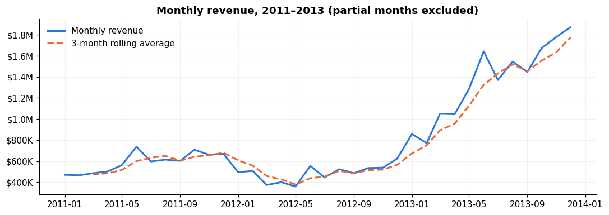
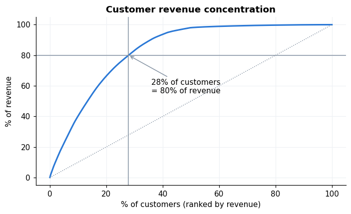
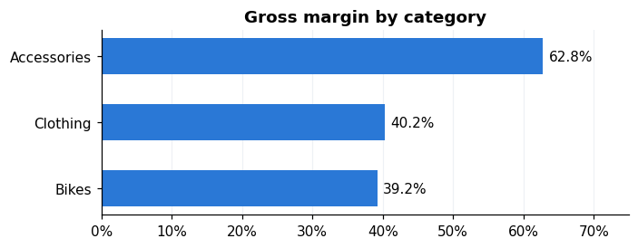
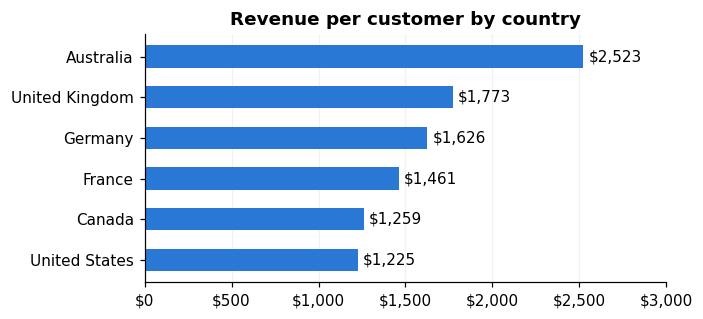

# 📌 Business Insights & Recommendations

**Client context (simulated):** a multi-country bicycle retailer whose CRM and ERP data was consolidated into the SQL warehouse in this repo.
**Question from leadership:** *"Revenue nearly tripled in 2013. What drove it, is it sustainable, and where should we focus next?"*
**Data:** Gold layer, 60,398 order lines · 27,659 orders · 18,484 customers · Dec 2010 – Jan 2014 · $29.36M revenue.
**Method:** SQL (warehouse + EDA), Python (statistics, RFM, cohorts: [`analysis/`](analysis/)), Power BI (dashboard: [`powerbi/`](powerbi/)).

---

## Executive summary

> **2013's +180% growth was bought through customer acquisition and a new accessories range, not by existing customers spending more.**
> The business now has a large, mostly one-time customer base and a high-value 2011–2012 cohort that is going quiet.
> The next phase of growth should come from **retention and monetisation** of customers it already has.

1. **Growth came from new customers and a new category.** 12,521 new customers joined in 2013 (vs 3,225 in 2012), and accessories/clothing launched. Orders grew ~6.5× while average order value fell from $1,787 to $768. That drop is a product-mix effect, not weaker demand.
2. **Bikes pay the bills, accessories carry the margin.** Bikes are 96.5% of revenue at a 39% margin. Accessories are 2.4% of revenue at a **63% margin**.
3. **63% of customers bought only once**, and ~28% of customers generate 80% of revenue.
4. **A third of revenue sits with customers who are drifting away.** RFM "At Risk (high value)": 2,888 customers, $9.6M lifetime revenue (33%), last order ~1 year ago on average.
5. **The US is under-monetised.** It has 2× Australia's customers but the same revenue: $1,225 per customer vs $2,523.

---

## Findings

### 1. What drove 2013?
| Year | Revenue | YoY | Orders | New customers | Avg order value |
|---|---|---|---|---|---|
| 2011 | $7.08M | | 2,216 | 2,216 | $3,193 |
| 2012 | $5.84M | −17% | 3,269 | 3,225 | $1,787 |
| 2013 | $16.34M | **+180%** | 21,287 | 12,521 | $768 |

Bike revenue alone grew from $5.84M to $15.35M in 2013, so the core business did grow. At the same time, 17,375 accessory and 7,124 clothing orders were added, which pulled the blended AOV down.
**So what:** any KPI deck that shows AOV falling 57% without splitting by category will send leadership after the wrong problem.

### 2. Revenue concentration

* Top 20% of customers → 66% of revenue; 28% of customers → 80% of revenue.
* 35 of the 130 products that sold → 80% of revenue (Road Bikes $14.5M, Mountain Bikes $10.0M, Touring Bikes $3.8M).

### 3. Category economics

| Category | Revenue share | Profit share | Gross margin |
|---|---|---|---|
| Bikes | 96.5% | 95.1% | 39.2% |
| Accessories | 2.4% | 3.8% | **62.8%** |
| Clothing | 1.2% | 1.2% | 40.2% |

71.5% of bike buyers already buy accessories. But **9,352 customers (half the base) have never bought a bike**: they entered through accessories/clothing in 2013.

### 4. Markets

| Country | Customers | Revenue/customer | Orders/customer | AOV |
|---|---|---|---|---|
| Australia | 3,591 | $2,523 | 1.87 | $1,349 |
| United Kingdom | 1,913 | $1,773 | 1.58 | $1,119 |
| Germany | 1,780 | $1,626 | 1.40 | $1,165 |
| France | 1,810 | $1,461 | 1.37 | $1,064 |
| Canada | 1,571 | $1,259 | **2.15** | $586 |
| United States | 7,482 | **$1,225** | 1.23 | $993 |

The US has the lowest repeat rate *and* below-average order value. Canada buys often but small, like an accessories market.

### 5. Customer health (RFM + cohorts)

| Segment | Customers | % revenue | What it means |
|---|---|---|---|
| Champions | 541 (3%) | 12% | Recent, frequent, high spend. Protect them |
| Loyal | 821 (4%) | 11% | Frequent buyers |
| Potential Loyalists | 3,593 (19%) | 32% | Recent, 2+ orders. Nurture them |
| **At Risk (high value)** | 2,888 (16%) | **33%** | Big spenders, silent for ~1 year. Win them back |
| New Customers | 4,148 (22%) | 8% | One recent, small order. Drive a 2nd purchase |
| Needs Attention / Hibernating | 6,491 (35%) | 5% | Low value, low priority |

2011–2012 bike buyers didn't return for 4–6 quarters, then re-activated at 25–45% once accessories launched in 2013. 2013 cohorts return at only ~8–11% in the following quarter.
**So what:** customers come back when there is something new and relevant to buy. Retention is a merchandising problem as much as a marketing one.

### 6. Demographics: what *not* to act on
* Women spend 4% more than men (p = 0.03). The difference is statistically significant but the effect size is negligible (Cohen's d = 0.03), so gender is **not** a useful targeting lever.
* Single customers spend 10% more than married ones (p < 0.001). The effect is real but small.

---

## Recommendations

Impact figures are **illustrative sizing** from the historical data, meant to rank the options rather than forecast them.

| # | Recommendation | Target | Sizing logic | Illustrative impact |
|---|---|---|---|---|
| 1 | **Win-back programme** for high-value lapsed customers (new-model launches, trade-in offer) | 2,888 At Risk customers | 5% reactivate × $2,129 avg historic order | **≈ $0.31M** |
| 2 | **Bike upsell** to accessory/clothing-only customers | 9,352 non-bike customers | 2% convert × $1,862 avg bike line | **≈ $0.35M** revenue (≈ $0.14M gross profit) |
| 3 | **US monetisation review**: pricing, assortment, premium bike mix | 7,482 US customers | +10% revenue per customer | **≈ $0.92M** |
| 4 | **Bundle accessories with every bike** and track *attach rate* as a KPI | 2,605 bike buyers with no accessories | Small in revenue, but at a 63% margin | Margin mix ↑ |
| 5 | **Second-purchase journey** 1–2 quarters after a first order | 4,148 New Customers | Lift next-quarter repeat rate from ~8% toward the 25%+ seen in re-activated cohorts | Retention ↑ |

## Next steps
1. Schedule a monthly refresh of the Power BI dashboard (RFM segments are already on the Customer Insights page) so the At Risk list stays current.
2. Confirm US pricing and assortment data with the client (not in this dataset).
3. A/B test recommendations 1 and 2 on a sample before a full rollout.

## Data caveats
* Jan 2014 contains only 4 weeks of data and Dec 2010 only 3 days; both are excluded from trend charts.
* 19 sales have an invalid order date (nulled in the Silver layer), and 337 customers have no country. They're shown as "Unknown", never dropped.
* **Age:** the SQL customer report computes age from today's date, which puts every customer in "40+". Age at purchase actually starts at 25 (median 42). The Power BI model uses age at first order instead.
* **Customer lifespan** is defined differently in PostgreSQL (`AGE()`, complete months) and in Power BI/SQL Server (`DATEDIFF`, month boundaries), which shifts VIP counts by ~2%. See [`Power BI Dashboard/validation/expected_kpis.md`](powerbi/validation/expected_kpis.md).
