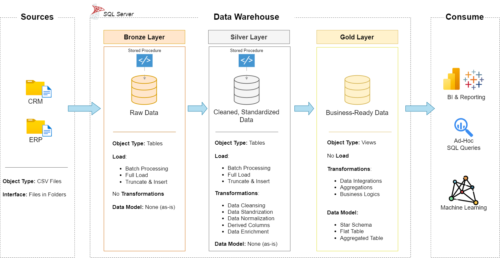
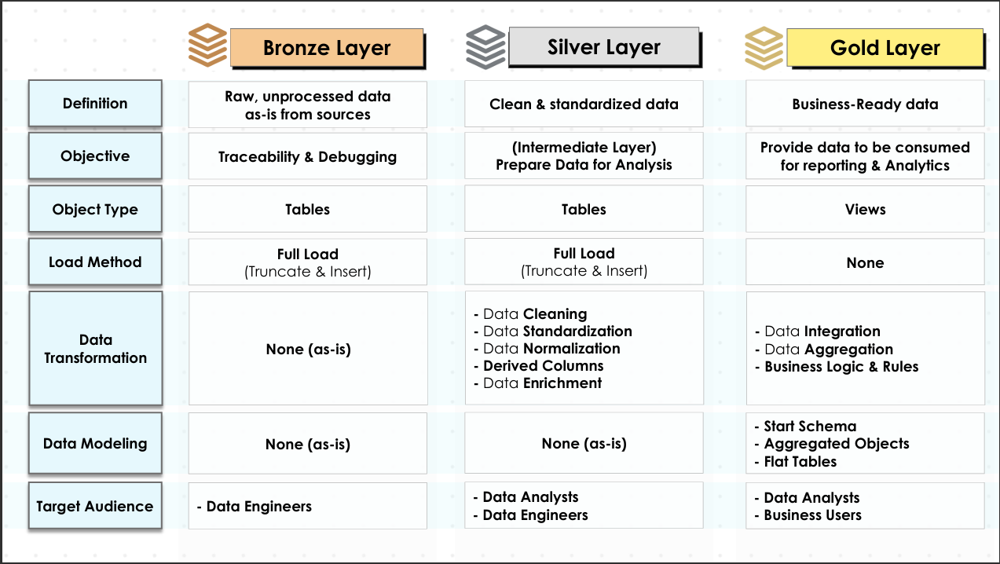

# 🚀 SQL Data Warehouse, Python Analytics & Power BI Dashboard


A complete, end-to-end **SQL-driven Data Warehouse & Analytics Project**, covering:

- **Data Modeling & ETL Pipeline (Bronze → Silver → Gold)**
- **Data Cleaning, Standardization & Transformation**
- **EDA + Advanced SQL Analytics**
- **Customer & Product Reporting**
- **Business Insights & KPI Generation**
- **Python Analytics: RFM segmentation, cohort retention, Pareto, significance testing**
- **Interactive Power BI Dashboard on the Gold Layer (DAX, star-schema model, RLS)**
- **Consulting-style Insights & Recommendations report**

This project simulates a **real industry-grade data engineering + business analytics workflow**, starting from raw ERP & CRM datasets and delivering insights with **SQL → Python → Power BI**, ending in business recommendations.

          

---

## 🔍 Summary  
This project builds a complete SQL Data Warehouse (Bronze → Silver → Gold) from raw ERP + CRM data, analyses it with advanced SQL and Python,
and delivers a 4-page **Power BI dashboard** and a **business insights report** for a retail business.

## 📌 Headline insights ([full report →](INSIGHTS.md))

| | Finding | So what |
|---|---|---|
| 📈 | 2013 revenue grew **+180%**, driven by 12.5K new customers + an accessories launch; AOV fell 57% purely from product mix | Report AOV by category, not blended |
| 💰 | Accessories earn a **62.8% margin** vs 39% for bikes | Bundle accessories with every bike |
| ⚠️ | **33% of revenue** sits with ~2,900 high-value customers who haven't ordered in ~a year (RFM "At Risk") | Win-back programme (≈ $0.3M illustrative upside) |
| 🌎 | US revenue per customer is **half of Australia's** ($1,225 vs $2,523) | US pricing/assortment review (≈ $0.9M at +10%) |
| 🔁 | **63%** of customers bought only once | Second-purchase journey after the first order |


---

## 📚 Table of Contents

- [🧩 Business Problem](#-business-problem)
- [🚀 Project Overview](#-project-overview)
- [🏗️ Project Architecture & Diagrams](#️-project-architecture--diagrams)
- [📊 Power BI Dashboard](#-power-bi-dashboard)
- [🐍 Python Analysis](#-python-analysis)
- [📌 Insights & Recommendations](INSIGHTS.md)
- [🏗️ Tech Stack](#️-tech-stack)
- [🧠 Key Skills Demonstrated](#-key-skills-demonstrated)
- [🗂️ Project Folder Structure](#️-project-folder-structure)
- [🛠️ Key Features](#-key-features)
- [📊 Reports Generated](#-reports-generated)
- [🧬 Data Architecture Flow](#-data-architecture-flow)
- [📁 Important Files](#-important-files)
- [📈 Key Outcomes](#-key-outcomes)
- [🎓 What I Will Learn](#-what-i-will-learn)
- [📥 Clone This Repository](#-clone-this-repository)
- [🏁 How to Run This Project](#-how-to-run-this-project)
- [⭐ Project Highlights (for Resume / Portfolio)](#-project-highlights-for-resume--portfolio)
- [📑 License](#-license)
- [⚠️ Dataset Disclaimer](#-dataset-disclaimer)
- [🧑‍💻 Author](#-author)

---

# 🧩 Business Problem

> 🏪 **Retail Company Issue:**  
> Data scattered across ERP & CRM → no unified reporting → poor insights → inconsistent decisions.

You built a scalable **Data Warehouse + Analytics System** to solve:

- Scattered data  
- Inconsistent formats  
- No single source of truth  
- No customer or product performance tracking  
- No advanced reporting  

The result is a **clean, scalable, analytics-ready warehouse**.

---

# 🚀 Project Overview

This project demonstrates how to build and analyze a data warehouse environment using SQL.  
It includes:

### ✅ 1. Data Warehouse Development
- Data ingestion (Bronze layer)  
- Data cleaning & harmonization (Silver layer)  
- Business modeling & fact/dimension tables (Gold layer)  
- Stored procedures for ETL  
- Data quality testing  
- Documentation (data model, flow diagrams, architecture)

### ✅ 2. EDA + Advanced SQL Data Analysis
Using advanced SQL analytics techniques:
- Ranking  
- Segmentation  
- Cumulative metrics  
- Change-over-time analysis  
- Performance metrics  
- Customer & Product reports  
- KPI calculations  
- Exploratory Data Analysis insights  

### ✅ 3. Advanced Reporting
SQL-based dashboards & reports:
- **Customer Analytics Report**
- **Product Performance Report**

### ✅ 4. Python Analysis
Statistical and customer analytics the SQL layer can't easily do ([notebook](analysis/retail_sales_analysis.ipynb)):
- Data-quality audit of the Gold layer (integrity, uniqueness, business rules)
- Pareto concentration, category margins, cross-sell / attach rate, market performance
- **RFM segmentation** (7 segments, exported to Power BI) and **quarterly cohort retention**
- Welch's t-tests + effect sizes to separate real differences from noise

### ✅ 5. Power BI Dashboard
A 4-page interactive report on the Gold layer:
- Star-schema model with a marked date table, an inactive ship-date relationship and hidden keys
- 33 DAX measures: time intelligence (YTD, YoY, rolling averages), profit, attach & repeat rates, ranking
- SQL segmentation logic re-implemented as DAX calculated columns; Python RFM segments merged in Power Query
- Synced slicers, dynamic titles and Row-Level Security
- Every KPI reconciled against SQL and Python outputs
- Saved as `.pbix` **and** as a text-based Power BI Project (TMDL + PBIR) for Git

### ✅ 6. Insights & Recommendations
A consulting-style [report](INSIGHTS.md): executive summary, findings, sized recommendations, next steps and data caveats.

---

# 📊 Power BI Dashboard

Open [`Power BI Dashboard/Sales_Performance.pbix`](powerbi/Sales_Performance.pbix) · [PDF export](powerbi/Sales_Performance.pdf) · [model, DAX & validation details](powerbi/README.md)

| Page | What it answers |
|---|---|
| **Executive Overview** | Sales, orders, customers, AOV, margin, repeat rate; monthly trend; sales by category, country, segment |
| **Sales Trends** | Selected vs. prior year, YoY growth, running total, year × quarter matrix |
| **Product Performance** | Profit, margin, accessory attach rate; top 10 products; category treemap; volume vs. margin; product ranking |
| **Customer Insights** | RFM segments, revenue per customer by country, age at first order, top 10 customers |

| | |
|---|---|
|  |  |
|  |  |

---

# 🐍 Python Analysis

[`Python Analysis/retail_sales_analysis.ipynb`](analysis/retail_sales_analysis.ipynb): pandas, NumPy, SciPy, Matplotlib.

| | |
|---|---|
|  |  |

---

# 🏗️ Project Architecture & Diagrams

### 📌 Overall Architecture  


### 🕸 Mesh Architecture Layers  


### 🔗 Data Integration Workflow  


### 🔄 Data Flow Diagram  


### 🧩 Star Schema Data Model  


---

# 🏗️ Tech Stack

| Layer | Tools Used |
|------|------------|
| Data Warehouse | PostgreSQL / SQL |
| Data Modeling | Star Schema, Dimensional Modeling |
| ETL Pipeline | SQL Stored Procedures |
| EDA & Analytics | SQL (Window functions, Aggregations, CTEs) |
| Statistical Analysis | Python (pandas, NumPy, SciPy, Matplotlib), Jupyter |
| Visualization / BI | Power BI Desktop, DAX, Power Query, TMDL/PBIP |
| Documentation | Markdown, PNG diagrams |

---

# 🧠 Key Skills Demonstrated

- Advanced SQL (Window Functions, CTEs, Ranking Functions)  
- Data Warehousing (Bronze–Silver–Gold architecture)  
- ETL Pipeline Development  
- Fact & Dimension Modeling  
- Data Cleaning & Standardization  
- Analytical Reporting & KPI Design  
- Data Architecture Documentation  
- Python: pandas data wrangling, RFM & cohort analysis, hypothesis testing (Welch's t-test, effect size)  
- Power BI: data modeling, DAX (time intelligence, context transition), Power Query, RLS  
- Business storytelling: turning analysis into sized, prioritised recommendations  

---

# 🗂️ Project Folder Structure

```
SQL Data Warehouse & Advanced Analytics/
│
│── 📄 README.md                               ← Main Project Documentation
│── 📑 LICENSE                                  ← License for Project
│
├── 🧱 Data Warehouse/
│   │
│   ├── scripts/                                ← ETL Scripts for Bronze → Silver → Gold
│   │   ├── bronze/
│   │   │   ├── ddl_bronze.sql                  ← Create Bronze Layer Tables
│   │   │   └── proc_load_bronze.sql            ← Load Raw ERP + CRM Data into Bronze
│   │   │
│   │   ├── silver/
│   │   │   ├── ddl_silver.sql                  ← Create Cleaned Silver Layer Tables
│   │   │   └── proc_load_silver.sql            ← Transform Bronze → Silver
│   │   │
│   │   └── gold/
│   │       └── ddl_gold.sql                    ← Create Final Fact & Dimensions (DW)
│   │
│   ├── tests/                                  ← Data Quality & Validation Scripts
│   │   ├── quality_checks_gold.sql             ← Gold Layer Validation Tests
│   │   └── quality_checks_silver.sql           ← Silver Layer Validation Tests
│   │
│   ├── docs/                                   ← Architecture, Models & Pipeline Diagrams
│   │   ├── Analysing Source System.png         ← Source System Exploration
│   │   ├── data_architecture.png               ← Full Data Architecture Overview
│   │   ├── data_catalog.md                     ← Documentation for All Tables & Columns
│   │   ├── data_flow.png                       ← End-to-End Data Flow Diagram
│   │   ├── data_integration.png                ← ERP + CRM Integration Overview
│   │   ├── data_layers.pdf                     ← Bronze, Silver, Gold Explanation
│   │   ├── data_model.png                      ← Data Warehouse Star Schema
│   │   ├── ETL.png                             ← ETL Pipeline Overview
│   │   ├── Mesh_Architecture_Layers.png        ← Data Mesh Architecture Layers
│   │   └── naming_conventions.md               ← Standards for Naming Tables & Columns
│   │
│   └── row_dataset/                            ← Raw ERP & CRM Source System Data
│       ├── source_erp/
│       │   ├── CUST_AZ12.csv                   ← ERP Customer Data
│       │   ├── LOC_A101.csv                    ← ERP Location Data
│       │   └── PX_CAT_G1V2.csv                 ← ERP Product/Category Data
│       │
│       └── source_crm/
│           ├── cust_info.csv                   ← CRM Customer Info
│           ├── prd_info.csv                    ← CRM Product Info
│           └── sales_details.csv               ← CRM Sales Transactions
│
├── 📊 EDA + Advanced Data Analysis/
│   │
│   ├── Data Analysis .png                       ← EDA Output Summary Diagram
│   │
│   ├── scripts/                                 ← All SQL Scripts for Analysis
│   │   ├── 00_init_database.sql                 ← Initialize Analysis Schema
│   │   ├── 01_database_exploration.sql          ← Explore Tables & Metadata
│   │   ├── 02_dimensions_exploration.sql        ← Explore Dimension Tables
│   │   ├── 03_date_range_exploration.sql        ← Explore Date Ranges
│   │   ├── 04_measures_exploration.sql          ← Explore Key Business Metrics
│   │   ├── 05_magnitude_analysis.sql            ← Magnitude-Level Analysis
│   │   ├── 06_ranking_analysis.sql              ← Ranking & Ordering Analysis
│   │   ├── 07_change_over_time_analysis.sql     ← Trend + Time-Based Analysis
│   │   ├── 08_cumulative_analysis.sql           ← Running Totals & Rolling Sums
│   │   ├── 09_performance_analysis.sql          ← Performance & KPI Insights
│   │   ├── 10_part_to_whole_analysis.sql        ← Proportional Contribution Analysis
│   │   ├── 11_data_segmentation.sql             ← Customer & Product Segmentation
│   │   ├── 12_report_customers.sql              ← Generate Customer Report (Gold Layer)
│   │   └── 12_report_products.sql               ← Generate Product Report (Gold Layer)
│   │
│   └── dataset/                                 ← Output Reports from Gold Layer
│       ├── gold.dim_customers.csv               ← Cleaned Customer Dimension
│       ├── gold.dim_products.csv                ← Cleaned Product Dimension
│       ├── gold.fact_sales.csv                  ← Cleaned Fact Sales Table
│       ├── gold.report_customers.csv            ← Final Customer Analytics Report
│       └── gold.report_products.csv             ← Final Product Analytics Report
│
├── 🐍 Python Analysis/
│   ├── retail_sales_analysis.ipynb              ← Data quality, Pareto, RFM, cohorts, t-tests
│   ├── charts/                                  ← Charts used in INSIGHTS.md
│   ├── output/rfm_segments.csv                  ← RFM segments (loaded into Power BI)
│   └── requirements.txt
│
├── 📈 Power BI Dashboard/
│   ├── Sales_Performance.pbix                   ← Power BI report (4 pages)
│   ├── Sales_Performance.pdf                    ← PDF export
│   ├── Sales_Performance.pbip                   ← Same report as a Power BI Project (TMDL + PBIR, Git-friendly)
│   ├── dax/measures.dax                         ← All DAX measures & calculated columns
│   ├── sql/01_bi_layer.sql                      ← gold.dim_date + read-only bi_reader role
│   ├── theme/warehouse_theme.json               ← Report theme
│   ├── validation/                              ← KPI reconciliation SQL + expected values
│   └── screenshots/                             ← Dashboard page screenshots
│
└── 📌 INSIGHTS.md                                ← Business insights & recommendations
```

---

# 🛠️ Key Features

### 🟩 Data Warehouse (Bronze → Silver → Gold)
- Raw data ingestion  
- Data profiling  
- Standardization & validation  
- Star schema modeling  
- Automated ETL procedures  
- Data quality tests  
- Complete documentation  

### 🟦 EDA + Advanced SQL Analytics
- Dimension exploration  
- Measures analysis  
- Ranking, segmentation  
- Time-series & cumulative trends  
- KPI calculations (Recency, AOV, Monthly Spend, etc.)  
- Customer & Product performance reports  

---

# 📊 Reports Generated

### 📘 Customer Report
Includes:
- Customer segments (VIP, Regular, New)
- Recency
- Lifespan
- Total orders, products, quantity, sales
- Avg order value
- Avg monthly spend  

### 📙 Product Report
Includes:
- Product segments (High Performer / Mid Range / Low Performer)
- Recency
- Lifespan
- Unique customers
- Avg selling price
- Monthly revenue  

---

# 🧬 Data Architecture Flow

```
RAW (ERP + CRM)
      ↓
BRONZE → Clean storage
      ↓
SILVER → Harmonized & Enriched Data
      ↓
GOLD → Final Fact + Dimension Tables
      ↓
ANALYTICS → Reports, KPIs, Dashboards
```

---

# 📁 Important Files

### 🔹 Data Warehouse Scripts

```
bronze/
    ddl_bronze.sql
    proc_load_bronze.sql
silver/
    ddl_silver.sql
    proc_load_silver.sql
gold/
    ddl_gold.sql
```

### 🔹 EDA SQL Scripts

```
00_init_database.sql  
01_database_exploration.sql  
02_dimensions_exploration.sql  
...  
12_report_customers.sql  
12_report_products.sql 
```

---

# 📈 Key Outcomes

- Built a fully functional SQL Data Warehouse  
- Designed & implemented ETL pipelines  
- Performed advanced SQL analytics  
- Designed star schema (Fact + Dimensions)  
- Developed customer & product analytical reports  
- Demonstrated real-world Data Engineer + Analyst workflow  
- Segmented customers with RFM and cohort analysis in Python  
- Delivered a 4-page Power BI dashboard reconciled to the warehouse  
- Turned findings into sized business recommendations ([INSIGHTS.md](INSIGHTS.md))  

---

# 🎓 What I Will Learn

- How to design a Data Warehouse from scratch  
- How to build ETL pipelines (Bronze → Silver → Gold)  
- How to clean & transform raw data  
- How to write advanced SQL analytical scripts  
- How to generate customer & product insights using SQL  
- How to document a real-world data engineering project 

---

# 📥 Clone This Repository
```
git clone https://github.com/arpit1021-ux/sql-data-warehouse-advanced-analytics.git
cd sql-data-warehouse-advanced-analytics
```

---

# 🏁 How to Run This Project

### 1. Initialize the Database
```
00_init_database.sql
```

### 2. Load Bronze Layer
```
proc_load_bronze.sql
```

### 3. Load Silver Layer
```
proc_load_silver.sql
```

### 4. Create Gold Layer
```
ddl_gold.sql
```

### 5. Run Analysis Scripts (00 → 12)
```
EDA + Advanced Data Analysis/scripts/
```

### 6. Run the Python analysis
```
cd analysis
pip install -r requirements.txt
jupyter notebook retail_sales_analysis.ipynb
```

### 7. Open the dashboard
```
Power BI Dashboard/Sales_Performance.pbix
→ Transform data → Edit parameters → RepoFolder = <your clone path>\
→ Home → Refresh
```

---

# ⭐ Project Highlights (for Resume / Portfolio)

- Real-world **Data Engineering + Analytics** workflow  
- End-to-end SQL project (**Data Warehousing + EDA + Advanced Data Analysis**)
- Realistic **ETL + Data Modeling** experience  
- Clean architecture & documentation  
- Retail analytics insights  
- Strong **Analytics + Business Insights** generation  
- Showcases SQL expertise at scale
- **Python** RFM segmentation, cohort retention and significance testing
- **Power BI dashboard** on the Gold layer with DAX time intelligence, RLS and KPI reconciliation
- **Consulting-style insights report** with sized recommendations

---

# 📑 License  
MIT License — see `LICENSE` file.

---

# ⚠️ Dataset Disclaimer  
All datasets used are **dummy, synthetic, or public**, intended only for learning and portfolio demonstration.  
No real customer or company data is used.

---

## 🧑‍💻 Author

**👤 Arpit Singh**  
📍 Computer & Communication Engineering Student | Software Engineering | SQL | Data Analytics   
📬 [LinkedIn](https://www.linkedin.com/in/arpitsingh05) | 🔗[GitHub](https://github.com/arpit1021-ux)

📧 [arpit.singh1183@gmail.com](mailto:arpit.singh1183@gmail.com)

---

⭐ *If you found this project helpful, feel free to star the repo and connect with me for collaboration!*
